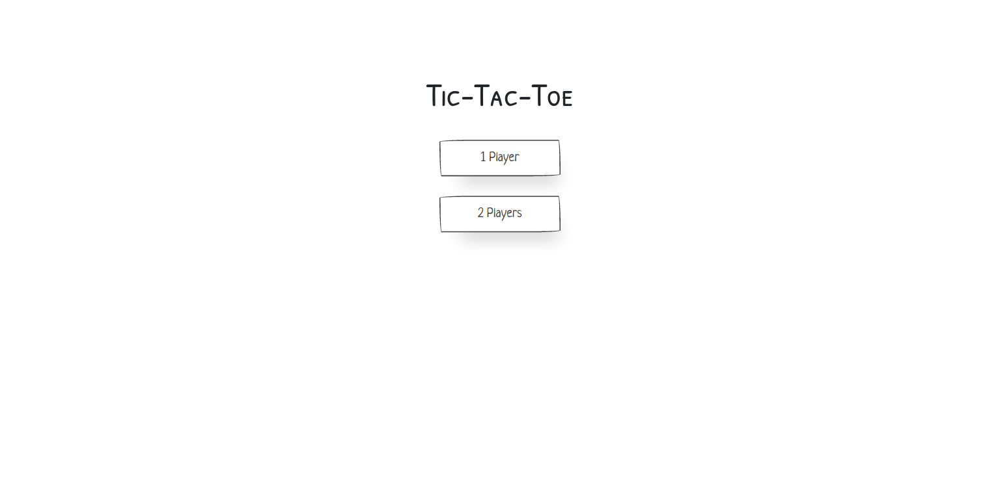
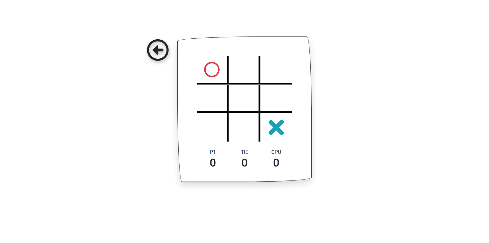
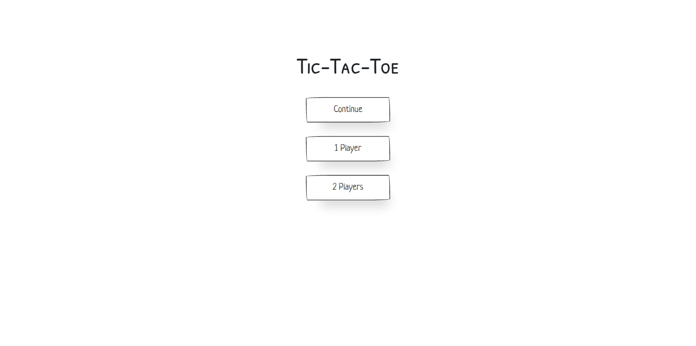
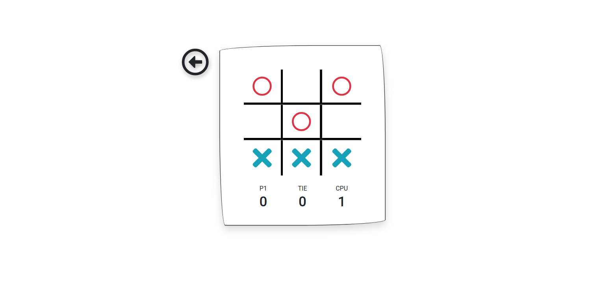

# Tic-Tac-Toe
A Tic-tac-toe game designed to be as minimalist as possible with only the most necessary elements present. [Visit Website](https://paper-tic-tac-toe.netlify.app/)
## Overview
The project has 2 pages:
1. The landing page with 1 player and 2 player option.
2. The game page with the game grid, win and tie counts and a back button.

## Resources used
1. The project uses customized bootstrap and paper CSS frameworks and another custom CSS file to achieve the desired look.
2. Javascript is used to manipuplate the grid and update game scores.
3. LocalStorage is used to store previous unfinished game data to load again if the player wants to coontinue with the previous game.

## Project screenshots

### Landing Page

### Single Player Mode

### Continue Screen

### Updated Player Stats

